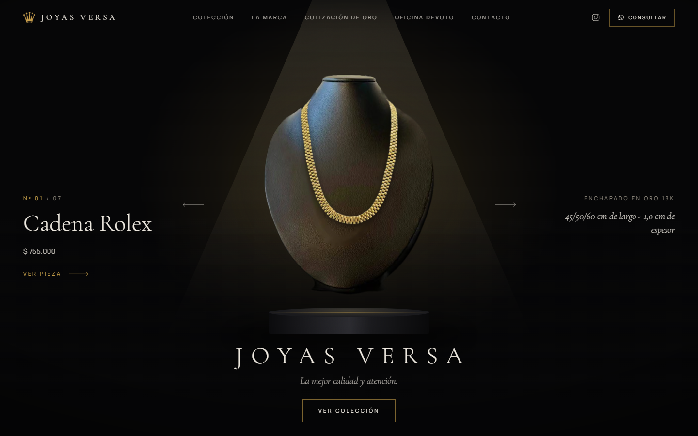
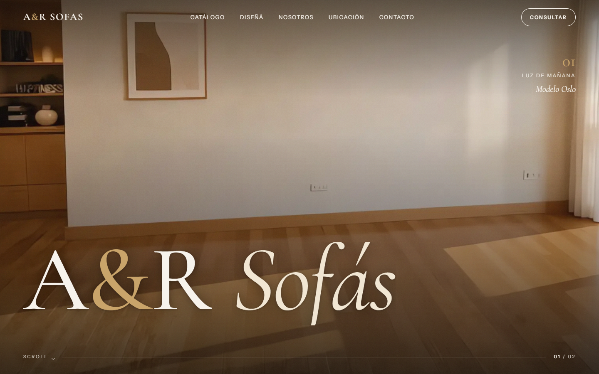
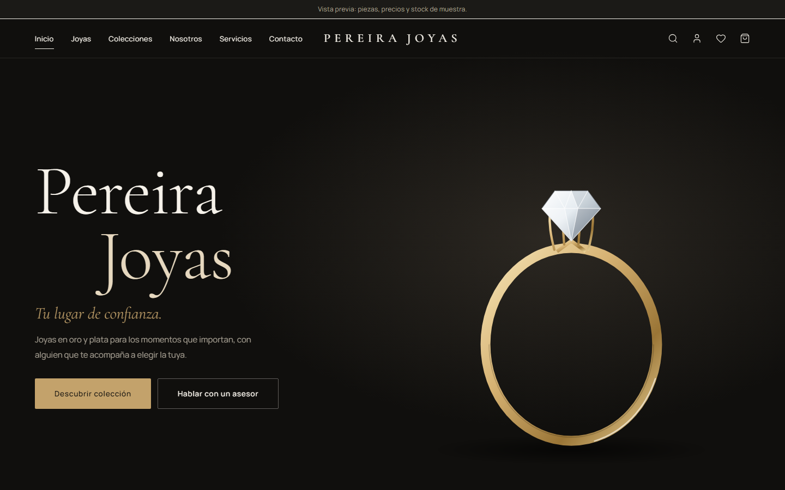
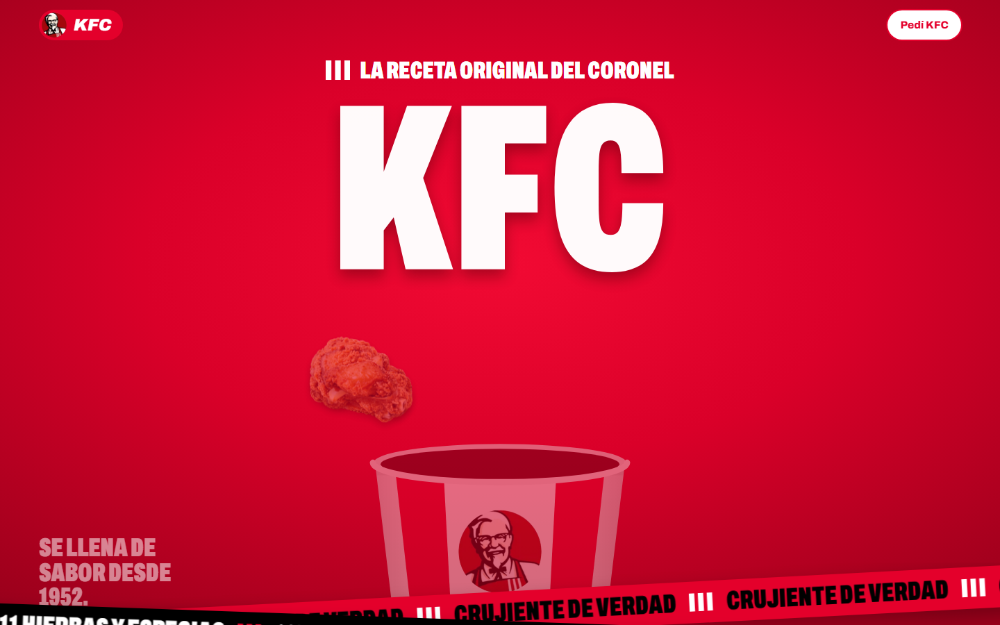
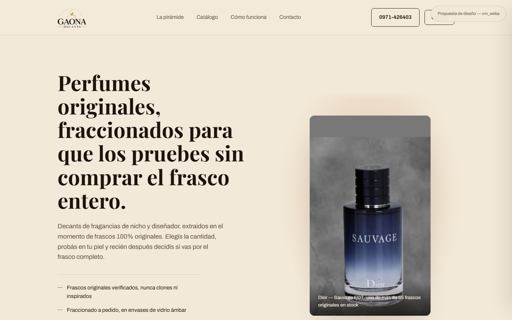
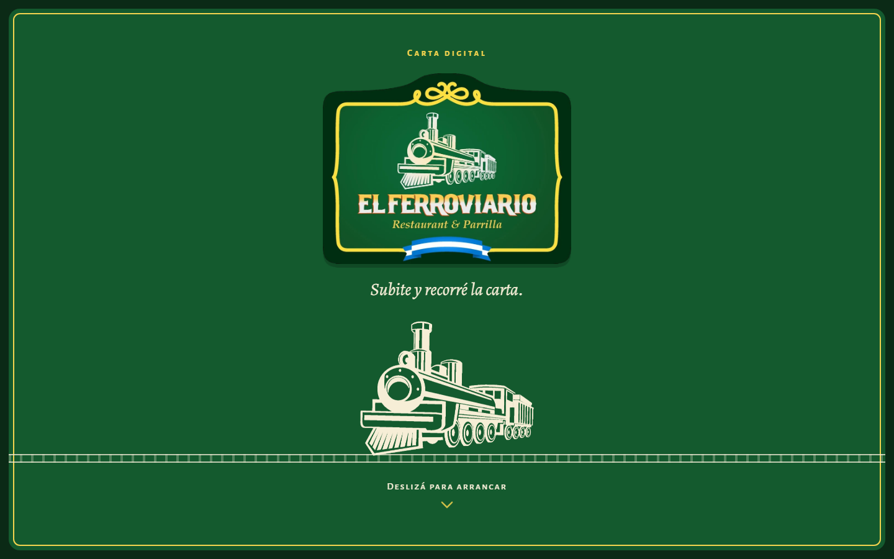
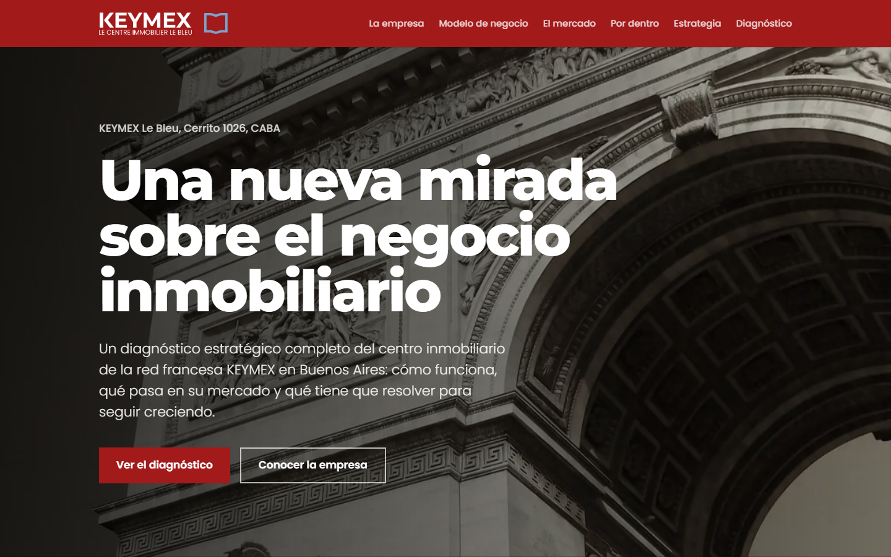
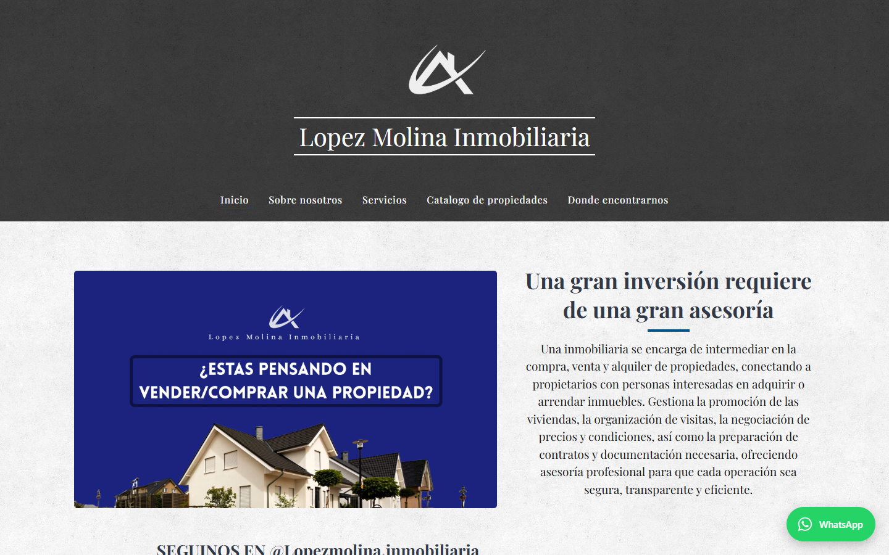

# Matías Andari

**Desarrollador Full Stack · Cofundador de [vm_webs](#-contacto)**

Diseño y desarrollo sitios web, tiendas online y automatizaciones para negocios reales, 
desde la primera pantalla hasta el deploy en producción.

 

 

## Qué hago

| | |
|---|---|
| 🖥️ **Sitios y landings** | Webs institucionales, catálogos y landings con animación, rápidas y pensadas para celular. |
| 🛒 **E-commerce** | Carritos, catálogos sincronizados, cobros con Mercado Pago y pedidos directos por WhatsApp. |
| ⚙️ **Sistemas a medida** | Paneles de administración, CRMs, gestión de stock, ventas y finanzas. |
| 🤖 **Automatización** | Bots de Discord y WhatsApp que atienden, registran y avisan sin intervención manual. |

 

## Proyectos

<table>
  <tr>
    <td width="50%" valign="top">
      
      <h3><a href="https://joyas-versa.vercel.app">Joyas Versa</a></h3>
      Joyería de oro enchapado con catálogo real importado de su tienda, galería de piezas y consultas por WhatsApp.
        
      <code>Next.js</code> <code>TypeScript</code> <code>Tailwind</code>
    </td>
    <td width="50%" valign="top">
      
      <h3><a href="https://ar-sofas.vercel.app">A&amp;R Sofás</a></h3>
      Showroom de sofás con hero en video, animaciones al hacer scroll y configurador de modelos.
        
      <code>HTML</code> <code>CSS</code> <code>GSAP</code>
    </td>
  </tr>
  <tr>
    <td width="50%" valign="top">
      
      <h3><a href="https://pereira-joyas.vercel.app">Pereira Joyas</a></h3>
      Joyería premium con colecciones, fichas de producto, favoritos y carrito.
        
      <code>Next.js 16</code> <code>TypeScript</code> <code>Tailwind</code>
    </td>
    <td width="50%" valign="top">
      
      <h3><a href="https://kfc-landing-lilac.vercel.app">KFC — Landing conceptual</a></h3>
      Concepto de landing de marca con animaciones encadenadas al hacer scroll.
        
      <code>HTML</code> <code>CSS</code> <code>GSAP</code> <code>ScrollTrigger</code>
    </td>
  </tr>
  <tr>
    <td width="50%" valign="top">
      
      <h3><a href="https://gaona-decants.vercel.app">Gaona Decants</a></h3>
      Tienda de perfumes fraccionados: catálogo, pirámide olfativa y carrito que arma el pedido por WhatsApp.
        
      <code>HTML</code> <code>CSS</code> <code>JavaScript</code>
    </td>
    <td width="50%" valign="top">
      
      <h3><a href="https://el-ferroviario-carta.vercel.app">El Ferroviario — Carta digital</a></h3>
      Menú QR para restaurante y parrilla, liviano y con precios fáciles de actualizar.
        
      <code>HTML</code> <code>CSS</code> <code>JavaScript</code>
    </td>
  </tr>
  <tr>
    <td width="50%" valign="top">
      
      <h3><a href="https://keymex-tpi.vercel.app">KEYMEX Le Bleu — Diagnóstico</a></h3>
      Sitio editorial con el diagnóstico estratégico de una inmobiliaria de la red francesa KEYMEX.
        
      <code>Next.js</code> <code>TypeScript</code>
    </td>
    <td width="50%" valign="top">
      
      <h3><a href="https://lopez-molina-web.vercel.app">López Molina Inmobiliaria</a></h3>
      Migración del sitio de la inmobiliaria a hosting propio, con formularios de compra y tasación a WhatsApp.
        
      <code>HTML</code> <code>CSS</code> <code>JavaScript</code>
    </td>
  </tr>
</table>

### Sistemas y herramientas internas

Código privado: trabajo para clientes y herramientas de [vm_webs](#-contacto). Demo disponible a pedido.

| Proyecto | Qué resuelve | Tecnologías |
|---|---|---|
| **Estrato** | E-commerce de suplementos con cobros reales vía Mercado Pago | Next.js 16 · Mercado Pago |
| **vm_webs CRM + Bot** | Bot de Discord con CRM de clientes y dashboard con login OAuth2 | discord.js · Prisma · PostgreSQL |
| **vm_webs Admin** | Panel interno: clientes, calendario, finanzas y presupuestos en PDF | Next.js · PostgreSQL |
| **Percha** | Gestión de tienda de ropa: stock, ventas, consignación y finanzas | Next.js · TypeScript |
| **Optimizer** | App de escritorio para optimizar Windows | Tauri · Rust · React |
| **Calori** | App móvil de seguimiento de calorías | Expo · React Native · Supabase |

 

## Stack

  

 

## 📫 Contacto

¿Tenés un negocio y necesitás una web, una tienda online o automatizar algo? Escribime.

